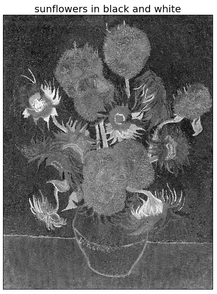
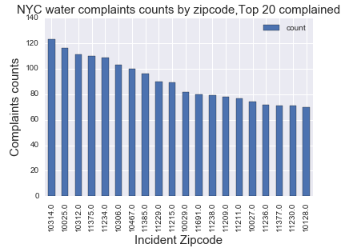

__Plot 1__ is a picture of sunflowers transformed in black and white color map.

__Plot 2__ shows the top 20 NYC zip codes with water related complaints. It shows a bar chart of complaint counts/zip code that delivers the information needed adequately. 

Few comments/suggestions I would have on the plot are:

* It would be nice if there was a caption describing the plot. 

* The plot is a bit small. It could be more visually-friendly if it would be larger. This also makes the title being outside the plot boundaries, that doesn’t look very pretty. 

* I believe that the time horizon of complaints should be included. In the plot title or caption maybe?

* I would replace the grid-like light blue background with blank white to make it look more neat.

* The zip codes on x-axis would be “prettier” If they were integers, and not floats. Additionally, few angles tilting would make x ticks easier to read!

* Also, in my opinion, instead of sorting the zip codes, I would present them in a “borough-clustered” format. This way, we could still see which ones are peaking but also get some spatial information of which boroughs complain more, or if nearby zip codes share the same amount of complaints. :)